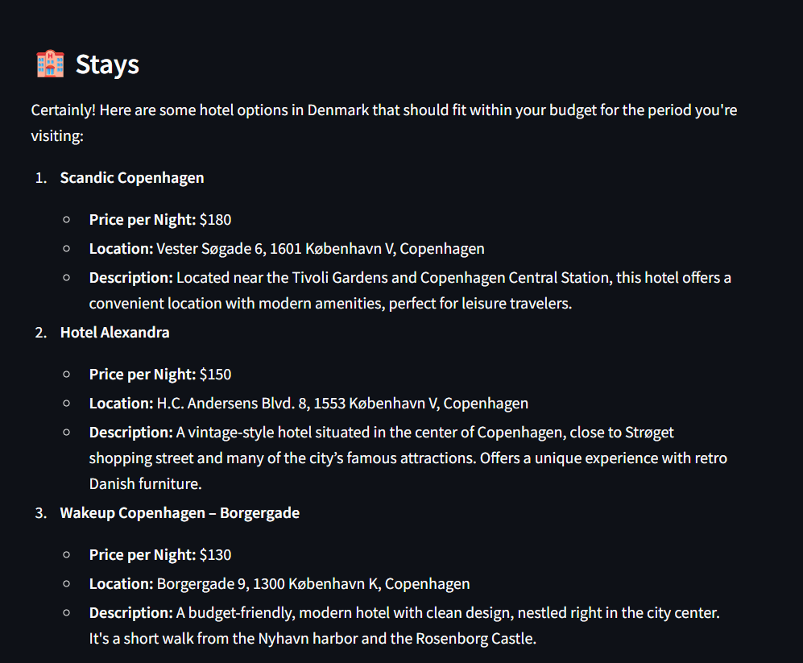

# ADK-Powered Travel Planner


## Overview

ADK-Powered Travel Planner is a sophisticated travel planning application built with Google's Agent Development Kit (ADK). The system uses a multi-agent architecture to coordinate various aspects of travel planning, including flights, accommodations, and activities.

The application leverages OpenAI's GPT-4o model through LiteLLM to generate realistic and helpful travel recommendations based on user inputs such as destination, travel dates, and budget constraints.

## Features

- **Multi-Agent Architecture**: Specialized agents handle different aspects of travel planning
  - **Host Agent**: Coordinates the entire trip planning process
  - **Flight Agent**: Suggests flight options with airline details and prices
  - **Stay Agent**: Recommends accommodation options
  - **Activities Agent**: Suggests things to do at the destination

- **Interactive UI**: Clean Streamlit interface for inputting travel preferences and viewing recommendations
- **Budget-Aware**: All recommendations consider the user's specified budget
- **Realistic Suggestions**: Generates plausible flight times, hotel options, and activities

## Implementation Details

### Project Structure

```
travel-planner-agent/
├── agents/                     # Agent implementations
│   ├── host_agent/             # Coordinates all other agents
│   │   ├── agent.py            # Host agent implementation
│   │   ├── task_manager.py     # Manages communication with other agents
│   │   ├── __main__.py         # Entry point for running the host agent
│   │   └── .well-known/        # Metadata
│   ├── flight_agent/           # Flight recommendation agent
│   ├── stay_agent/             # Accommodation recommendation agent
│   └── activities_agent/       # Activity recommendation agent
├── common/                     # Shared utilities
│   ├── a2a_client.py           # Agent-to-agent communication client
│   └── a2a_server.py           # Agent-to-agent communication server
├── imgs/                       # Screenshot images
├── shared/                     # Shared resources
├── load_env.py                 # Environment variable loader
├── requirements.txt            # Project dependencies
└── travel_trip.py              # Streamlit UI implementation
```

### Architecture

The system uses an agent-to-agent (A2A) communication architecture:

1. **User Interface (Streamlit)**: Collects travel preferences from the user
2. **Host Agent (Port 8000)**: Receives the request and coordinates the planning
3. **Specialized Agents**:
   - **Flight Agent (Port 8001)**: Receives flight search parameters, returns flight options
   - **Stay Agent (Port 8002)**: Receives accommodation search parameters, returns stay options
   - **Activities Agent (Port 8003)**: Receives activity search parameters, returns activity suggestions
4. **Result Aggregation**: The Host Agent combines all results and returns a comprehensive travel plan

### Technologies Used

- **Google ADK**: Framework for building and managing AI agents
- **LiteLLM**: Interface to access OpenAI's GPT-4o model
- **FastAPI**: Backend API framework for agent communication
- **Streamlit**: Frontend user interface
- **Uvicorn**: ASGI server for running the FastAPI applications
- **HTTPX**: Asynchronous HTTP client for inter-agent communication
- **Python-dotenv**: For loading environment variables from .env files

## Installation

### Prerequisites

- Python 3.9+ installed
- OpenAI API key

### Step 1: Clone the Repository

```bash
git clone https://github.com/HarshTomar1234/Travel-Planner.git
cd Travel-Planner
```

### Step 2: Install Dependencies

```bash
pip install -r requirements.txt
```
### Step 3: Set Up Environment Variables

Create a `.env` file in the root directory with your OpenAI API key:

```
OPENAI_API_KEY=your_openai_api_key_here
```

## Running the Application

### Step 1: Start the Agent Services

Open four separate terminal windows and run each agent service:

```bash
# Terminal 1 - Flight Agent (Port 8001)
python -m agents.flight_agent

# Terminal 2 - Stay Agent (Port 8002)
python -m agents.stay_agent

# Terminal 3 - Activities Agent (Port 8003)
python -m agents.activities_agent

# Terminal 4 - Host Agent (Port 8000)
python -m agents.host_agent
```

### Step 2: Launch the Streamlit UI

In a fifth terminal window, run:

```bash
streamlit run travel_trip.py
```

The application will open in your default web browser at http://localhost:8501.

### Step 3: Plan Your Trip

1. Enter your origin (e.g., "New York")
2. Specify your destination (e.g., "Denmark")
3. Set your travel dates
4. Define your budget
5. Click "Plan My Trip ✨"

## Example Results

### Flight Recommendations


The system will suggest flight options with details such as:
- Airline name
- Departure and return times
- Price
- Direct or connecting information

### Accommodation Options



Stay recommendations include:
- Hotel/accommodation name
- Location details
- Price per night
- Amenities and features

### Activity Suggestions


Activity suggestions include:
- Name of the activity
- Description
- Estimated price
- Duration
- Practical tips

## Troubleshooting

- **API Key Issues**: Ensure your OpenAI API key is correctly set in the `.env` file
- **Agent Connection Errors**: Make sure all agent services are running on their respective ports
- **Budget Constraints**: If no results appear, try increasing your budget

## Future Enhancements

- Integration with real travel APIs for actual booking
- User authentication and saved trips
- Offline mode for previously generated plans
- Mobile app version


Built with ❤️ using Google's Agent Development Kit (ADK) 
